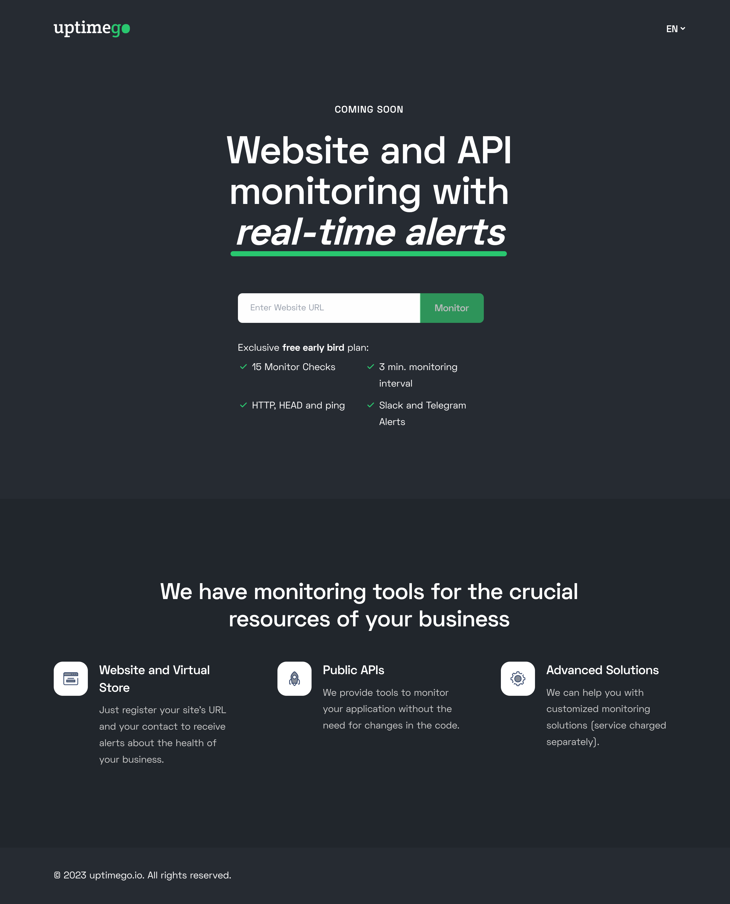

# UptimeGo
Website and API monitoring with real-time alerts.



## Table of Contents
- [Installation](#installation)
- [Features](#features)
- [Contributing](#contributing)
- [License](#license)
- [Acknowledgements](#acknowledgements)

## Installation
Step-by-step instructions on how to install and set up the project locally.

1. **Clone the repository:**
   ```sh
   git clone https://github.com/washingtonserip/uptimego.git
   cd uptimego
   ```

2. **Install dependencies:**
   Ensure you have Maven installed. Then run:
   ```sh
   mvn install
   ```

3. **Set up the database:**
    - Create a new database in your SQL server.
    - Update the `application.properties` file with your database configuration.

4. **Run the application:**
   ```sh
   mvn spring-boot:run
   ```

## Features
- Real-time monitoring of websites and APIs
- Customizable alert notifications
- Detailed performance reports and analytics
- Easy integration with various third-party services
- User-friendly web interface for configuration and monitoring

## Contributing
Guidelines for contributing to the project, including how to submit issues and pull requests.

1. Fork the repository.
2. Create a new branch (`git checkout -b feature-branch`).
3. Make your changes.
4. Commit your changes (`git commit -m 'Add some feature'`).
5. Push to the branch (`git push origin feature-branch`).
6. Open a pull request.

## License
This project is licensed under the GNU General Public License v3.0. See the `LICENSE` file for more details.

## Acknowledgements

This project makes use of several open-source libraries and frameworks. We would like to acknowledge their developers and contributors for their hard work and dedication:

- **Spring Boot**: A framework for building production-ready applications in Java. [Spring Boot GitHub](https://github.com/spring-projects/spring-boot)
- **Maven**: A build automation tool used primarily for Java projects. [Maven GitHub](https://github.com/apache/maven)
- **H2 Database**: An open-source lightweight Java database. [H2 Database GitHub](https://github.com/h2database/h2database)
- **Thymeleaf**: A modern server-side Java template engine for web and standalone environments. [Thymeleaf GitHub](https://github.com/thymeleaf/thymeleaf)
- **JUnit**: A simple framework to write repeatable tests in Java. [JUnit GitHub](https://github.com/junit-team/junit5)

We are grateful to these projects and their communities for providing the tools and libraries that make our work possible.
